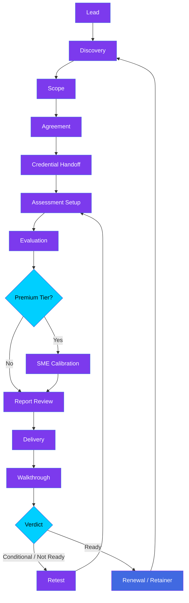
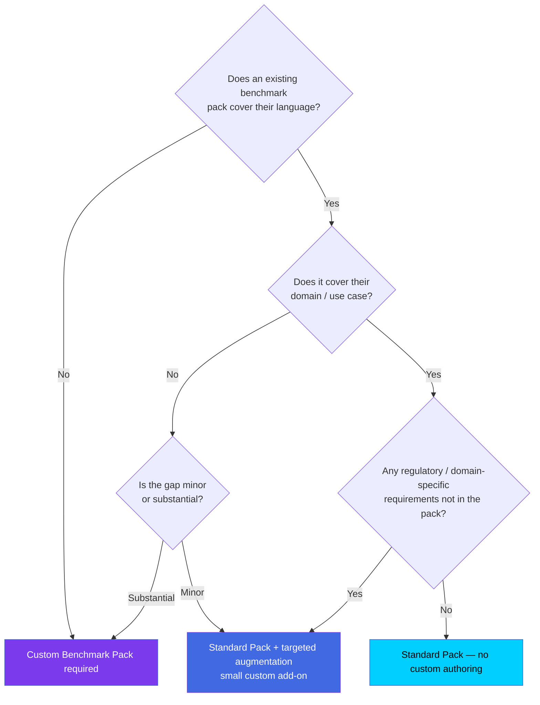
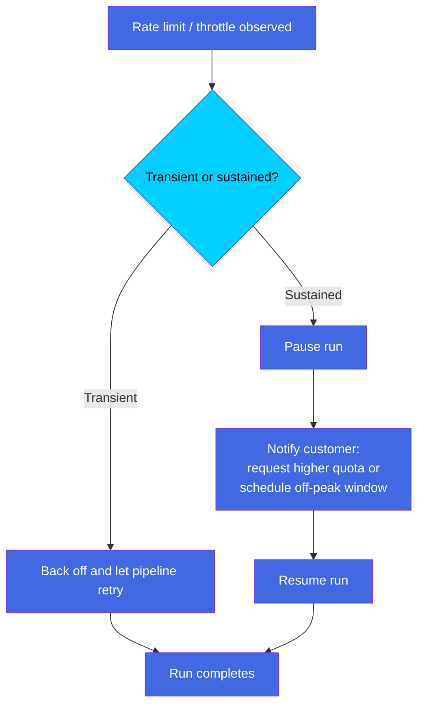
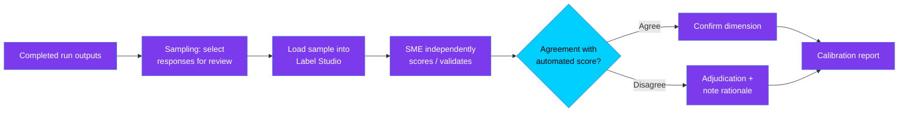
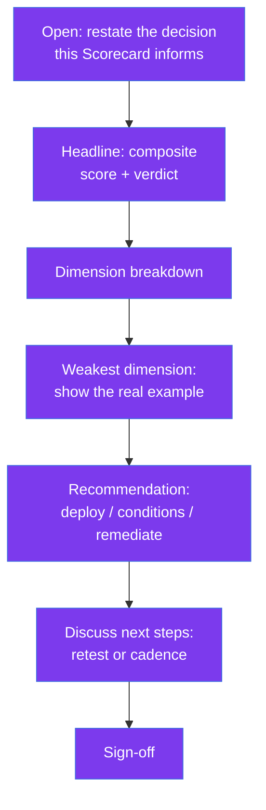
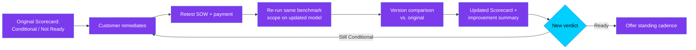

<!--
====================================================================
  AGENTIFYAFRO.AI  ·  BRAND HEADER
  Pure Black #000000 | Purple #7C3AED → Blue #4169E1 → Cyan #00CFFF | White #FFFFFF
  Typography: Headings — bold sans (Inter / Segoe UI). Body — regular sans.
  Logo guidance: AgentifyAfro wordmark on black or white only. Maintain clear
  space equal to the height of the "A" on all sides. Never recolor the gradient.
====================================================================
-->

<div align="center">

# AfroEval™ Concierge — Operations Playbook

### The Official Internal Operating Manual for Delivering AfroEval Concierge Engagements

**AgentifyAfro.ai** · AI Model Training & Evaluation Services

`Version 1.0` · `Owner: COO / Delivery` · `Classification: Internal — Confidential`

</div>

---

> **Brand palette used throughout this document**
>
> | Token | Hex | Use |
> |---|---|---|
> | **Pure Black** | `#000000` | Primary text, headers, cover |
> | **Purple** | `#7C3AED` | Primary accent, phase markers |
> | **Blue** | `#4169E1` | Secondary accent, links, diagrams |
> | **Cyan** | `#00CFFF` | Highlights, callouts, success states |
> | **White** | `#FFFFFF` | Backgrounds, reverse type |
>
> Gradient direction is always **Purple → Blue → Cyan**, left to right. Apply the gradient to section dividers, cover elements, and the scorecard banner — never to body text.

---

## Document Control

| Field | Detail |
|---|---|
| **Document title** | AfroEval Concierge — Operations Playbook |
| **Document type** | Operational handbook (SOP-grade) |
| **Status** | Active — living document |
| **Version** | 1.0 |
| **Effective date** | 2026-06-27 |
| **Review cadence** | Quarterly, or after every 5 completed engagements |
| **Owner** | Chief Operating Officer / Delivery Lead |
| **Supersedes** | `afroeval-concierge-engagement-playbook.md` (lightweight reference — now folded into this manual) |
| **Related documents** | AfroEval Messaging Playbook · AfroEval Architecture · Brand Guidelines · Investor Materials · Security Rules (codebase) |

**How to use this manual.** This is the definitive operating reference for the AfroEval Concierge service. A new operations manager should be able to run an entire engagement — from first sales conversation to final delivery and renewal — by following the phases, SOPs, checklists, and templates contained here. Treat it as a living document: update it as the real process evolves, and version every change.

---

## Table of Contents

1. [Executive Overview](#1-executive-overview)
2. [Engagement Lifecycle Overview](#2-engagement-lifecycle-overview)
3. [Phase 1 — Discovery Call](#3-phase-1--discovery-call)
4. [Phase 2 — Scope & Commercial Agreement](#4-phase-2--scope--commercial-agreement)
5. [Phase 3 — Credential Handoff](#5-phase-3--credential-handoff)
6. [Phase 4 — Run Evaluation](#6-phase-4--run-evaluation)
7. [Phase 5 — SME Calibration (Premium Tier)](#7-phase-5--sme-calibration-premium-tier)
8. [Phase 6 — Internal Report Review](#8-phase-6--internal-report-review)
9. [Phase 7 — Customer Delivery & Walkthrough](#9-phase-7--customer-delivery--walkthrough)
10. [Phase 8 — Retest Cycle](#10-phase-8--retest-cycle)
11. [Concierge Pricing Framework](#11-concierge-pricing-framework)
12. [Internal SOPs](#12-internal-sops)
13. [Admin Console Operations](#13-admin-console-operations)
14. [Templates & Checklists](#14-templates--checklists)
15. [KPIs & Success Metrics](#15-kpis--success-metrics)
16. [Future Operational Roadmap](#16-future-operational-roadmap)

---

<a name="1-executive-overview"></a>

## 1. Executive Overview

### 1.1 What AfroEval Concierge Is

AfroEval Concierge is AgentifyAfro's **fully-delivered, expert-led evaluation service** for AI systems deployed into African-language and emerging markets. The customer brings an AI model; AgentifyAfro runs a rigorous, structured assessment of that model against curated benchmark packs and returns an **AfroEval Scorecard™** — a board-ready verdict on whether the model is safe and ready to deploy in the target market, with the specific evidence behind that verdict.

Concierge means the customer does almost nothing operationally. They hand over scoped API access to their model, state the decision they need to make, and AgentifyAfro handles benchmark selection, execution, human calibration (where contracted), interpretation, and delivery. The output is not a raw data dump — it is an **interpreted, decision-grade assessment** delivered by people who understand both the technology and the market context.

### 1.2 Who It Serves

The highest-fit customers are organizations deploying AI under real commercial or regulatory exposure in African-language markets:

| Segment | Typical buyer | Why they buy |
|---|---|---|
| **Financial services** | Banks, mobile-money operators, fintechs | A wrong answer in Swahili or Hausa about a money transfer is a direct financial and trust loss |
| **Telecommunications** | Telco customer-service and self-service AI owners | High volume, multilingual, brand-exposed |
| **Health-tech** | Digital health platforms, triage assistants | Safety-critical; mistakes carry clinical and legal risk |
| **Public sector & gov services** | Citizen-facing service platforms | Accountability, inclusion mandates, public scrutiny |
| **Agriculture & development** | AgTech, NGOs, donor-funded programs | Reach underserved populations in local languages |

The common thread: they are **already deploying (or about to deploy)** an AI assistant into an African-language market, they carry **real cost if it gets things wrong**, and they are **not yet running rigorous African-language-specific evaluation internally**. That gap is the entire reason the service exists.

### 1.3 Why the Concierge Model Exists

The AfroEval platform already does everything required to deliver a paid engagement: provider/model configuration, benchmark pack selection, automated scoring, reporting, and optional human SME calibration via Label Studio. None of that requires multi-tenancy, customer-facing API keys, or an SDK.

Concierge-first is a **deliberate sequencing decision**, not a limitation:

- **Sell and deliver manually first, automate what repeats.** This is the standard playbook for B2B infrastructure products before product-market fit. Building self-service infrastructure before proven repeat demand means guessing at requirements instead of learning them from real engagements.
- **The interpretation is the product.** The concierge layer — translating dimension scores into a clear go/no-go narrative tied to the customer's actual decision — is where the value is. That expertise cannot be shipped as an SDK on day one.
- **Margin and trust.** High-touch delivery commands premium pricing and builds the reference relationships that later justify a self-service investment.

The multi-tenant REST API + SDK path remains explicitly parked until concierge engagements produce evidence of repeat self-service demand — at which point the build is informed by what customers actually asked for.

### 1.4 Software vs. Service — The Critical Distinction

This is the single most important framing for anyone operating the engagement. Read it carefully.

| | **The Software (AfroEval Platform)** | **The Service (AfroEval Concierge)** |
|---|---|---|
| **What it is** | Assessment Console, Benchmark Packs, Evaluation Engine, Reporting Engine, Label Studio HITL, Supabase auth | The end-to-end human-led engagement that uses the software to produce a decision |
| **Who operates it** | AgentifyAfro operators only (internal) | AgentifyAfro delivery team, customer-facing |
| **What the customer sees** | Nothing — they never log in | A Scorecard, a walkthrough, and a recommendation |
| **Where the value sits** | Speed, rigor, repeatability | Interpretation, market expertise, trust, accountability |
| **What is sold** | Not sold directly | This is what is sold |

> **Operating principle:** The customer is buying an outcome — *"Is my AI ready for this market, and what do I fix?"* — not access to a tool. Every operational decision in this playbook should protect the quality of that outcome.

### 1.5 Customer Journey Overview

From the customer's perspective, the journey is short and low-effort:

1. **A conversation** about what they're deploying and what could go wrong.
2. **A clear scope and price.**
3. **A one-time, secure handover** of access to their model.
4. **A wait** (turnaround communicated upfront).
5. **A Scorecard and a walkthrough** that tells them exactly where they stand.
6. **A path forward** — fix-and-retest, or a standing re-evaluation cadence.

Everything that makes that journey rigorous happens on AgentifyAfro's side, invisibly. The rest of this playbook documents that side in full.

---

<a name="2-engagement-lifecycle-overview"></a>

## 2. Engagement Lifecycle Overview

The AfroEval Concierge engagement moves through thirteen stages, grouped into eight operational phases. Stages flow in sequence; SME Calibration is conditional on tier, and the Retest loop is conditional on verdict.

### 2.1 Lifecycle at a Glance



### 2.2 Phase Map

| Phase | Stage(s) | Owner | Typical duration | Gate to advance |
|---|---|---|---|---|
| **Sales** | Lead → Discovery | Delivery Lead | 1–3 days | Qualified, fit confirmed |
| **Phase 2** | Scope → Agreement | Delivery Lead | 2–5 days | Signed SOW + deposit |
| **Phase 3** | Credential Handoff | Operator | 1 day | Credentials validated |
| **Phase 4** | Assessment Setup → Evaluation | Operator | 1–3 days | Run completed, outputs valid |
| **Phase 5** | SME Calibration *(Premium)* | Operator + SME | 2–5 days | Calibration report signed off |
| **Phase 6** | Report Review | QA Reviewer | 1–2 days | Internal QA approval |
| **Phase 7** | Delivery → Walkthrough | Delivery Lead | 1–3 days | Customer sign-off |
| **Phase 8** | Retest → Renewal | Delivery Lead | Ongoing | New SOW or retainer |

### 2.3 Standard Turnaround Commitments

These are the default external commitments. Adjust per SOW; never commit shorter than the team can reliably deliver.

| Deliverable | Standard | Premium (calibrated) |
|---|---|---|
| Standard pack, single model | 5 business days | — |
| Calibrated, single model | — | 8–10 business days |
| Custom benchmark authoring | +5–10 business days (separate line item) | +5–10 business days |
| Retest (same scope) | 3 business days | 5–7 business days |

---

<a name="3-phase-1--discovery-call"></a>

## 3. Phase 1 — Discovery Call

### 3.1 Objectives

The Discovery Call has four jobs: **qualify** the customer, **understand the decision** the Scorecard must inform, **determine the benchmark configuration** (standard vs. custom), and **set expectations** on turnaround and what AgentifyAfro will need from them. It is a 30–45 minute conversation, not a sales pitch — the operator listens more than talks.

### 3.2 Discovery Questions

Work through these systematically and capture answers in the Discovery Call Notes template ([§14.1](#141-discovery-call-notes)).

**Market & language**
- Which countries/markets are you deploying into?
- Which languages and dialects must the AI handle? Which are highest-volume / highest-risk?
- Is this a single-language deployment or multilingual?

**Domain & use case**
- What does the AI actually do? (mobile money, customer service, healthcare triage, agricultural advisory, public services, etc.)
- What is the single worst outcome if it answers wrong?

**Technical stack**
- Which model(s) are you running or evaluating? (Provider + exact model identifier — e.g., Azure OpenAI `gpt-4o`, Anthropic `claude-sonnet`, etc.)
- Self-hosted, API-based, or fine-tuned? Any retrieval/RAG layer in front of it?
- Can you provision a scoped API key for evaluation?

**Decision & timeline**
- What decision does this Scorecard inform? (Go/no-go launch, internal audit, vendor comparison, board/regulator assurance.)
- When do you need the result? What's driving that date?

**Risk posture**
- Are you under regulatory or contractual obligation to evaluate?
- Has anything already gone wrong that prompted this?

**Current state**
- Are you evaluating African-language performance internally today? How?

### 3.3 Customer Qualification

Score the lead against the Ideal Customer Profile before quoting. A strong-fit customer satisfies all three core criteria.

| Criterion | Strong fit | Weak fit |
|---|---|---|
| **Deployment stage** | Live or launching within 90 days in an African-language market | Exploratory, no concrete deployment |
| **Risk exposure** | Real commercial/regulatory cost if AI errs | Low-stakes / internal experiment |
| **Evaluation gap** | No rigorous African-language eval internally | Already has mature in-house eval |
| **Decision clarity** | Specific decision tied to a date | "Just curious how good it is" |
| **Budget authority** | Buyer can approve or directly influence | No budget, gathering information only |

> **Disqualification is a valid, healthy outcome.** A customer with no real decision and no risk exposure will not value the Scorecard and will be a difficult engagement. Politely route them to a lighter resource and preserve delivery capacity for strong-fit work.

### 3.4 Standard Pack vs. Custom Benchmark — Decision Tree



**Rules of thumb**
- **Standard Pack** — an existing pack matches both language and domain, with no special regulatory requirements. Fastest, lowest-priced path.
- **Standard + Augmentation** — mostly covered, but a small set of customer-specific or regulatory cases must be added. Small add-on line item.
- **Custom Benchmark Pack** — language not covered, or domain coverage is substantially absent. This is **separate, higher-priced authoring work**, never bundled into a standard engagement, and adds 5–10 business days. (See pricing [§11.4](#114-custom-benchmark-authoring).)

### 3.5 Deliverables of Phase 1

- Completed Discovery Call Notes
- Qualification verdict (proceed / disqualify / nurture)
- Benchmark configuration recommendation (standard / augmented / custom)
- A clear statement back to the customer of turnaround and required inputs

### 3.6 Phase 1 Checklist

- [ ] Markets and languages captured
- [ ] Domain and worst-case outcome captured
- [ ] Provider + exact model identifier(s) captured
- [ ] Decision the Scorecard informs is explicit
- [ ] Timeline and its driver captured
- [ ] Qualification scored against ICP
- [ ] Benchmark path determined (standard / augmented / custom)
- [ ] Turnaround and required inputs communicated to customer
- [ ] Notes filed; next step (scope) scheduled

### 3.7 Success Criteria

A successful Discovery Call ends with **both sides able to state, in one sentence, what decision this engagement will inform and roughly what it will cost.** If the operator cannot articulate the customer's decision, discovery is not complete.

### 3.8 Common Pitfalls

| Pitfall | Consequence | Prevention |
|---|---|---|
| Quoting before understanding the decision | Mis-scoped engagement, margin loss | Never price until §3.7 is met |
| Missing the exact model identifier | Wrong model evaluated, rework | Confirm provider + identifier in writing |
| Treating custom pack work as "included" | Unpaid bespoke authoring, blown timeline | Apply the decision tree explicitly |
| Over-promising turnaround | Broken commitment, trust damage | Quote standard turnarounds (§2.3), add buffer |
| Failing to identify the buyer | Stalled deal | Confirm budget authority in discovery |

---

<a name="4-phase-2--scope--commercial-agreement"></a>

## 4. Phase 2 — Scope & Commercial Agreement

### 4.1 Objective

Convert the discovery understanding into a **clear, written, signed Scope of Work (SOW)** with agreed deliverables, timeline, price, data-handling terms, and acceptance criteria — and collect the agreed deposit before any evaluation work begins.

### 4.2 Scope of Work — Required Contents

Every SOW must specify, at minimum:

| Section | What it locks down |
|---|---|
| **Models in scope** | Provider + exact model identifier(s); count of models |
| **Benchmark packs in scope** | Named pack(s); standard / augmented / custom; count of packs |
| **Tier** | Standard Scorecard or Calibrated Scorecard |
| **Deliverable format** | PDF Scorecard; JSON export (yes/no); live walkthrough (yes/no) |
| **Timeline** | Start trigger (credential receipt), turnaround, delivery date |
| **Price & payment terms** | Total, deposit %, balance trigger |
| **Data handling** | Treatment of model outputs and credentials during and after (link to Phase 3 & 9) |
| **Acceptance criteria** | What "delivered and accepted" means |
| **Disclaimers** | Scorecard is an assessment, not a warranty or compliance certification |

### 4.3 Deliverables Matrix

| Deliverable | Standard | Calibrated |
|---|---|---|
| AfroEval Scorecard PDF | ✅ | ✅ |
| JSON export | Optional | ✅ |
| Plain-language cover note | ✅ | ✅ |
| SME calibration appendix | — | ✅ |
| Live walkthrough call | Optional add-on | ✅ (included) |
| Recommendation summary | ✅ | ✅ |

### 4.4 Timeline

Anchor the timeline to **credential receipt**, not contract signature — the clock starts when AgentifyAfro can actually begin. State turnaround in business days and include the SME calibration window where the Premium tier applies. Always quote the standard turnarounds from [§2.3](#23-standard-turnaround-commitments) plus a buffer.

### 4.5 Pricing Model — Standard vs. Premium

Pricing is a **flat fee per engagement**, scoped to the number of benchmark packs and number of models evaluated. SME calibration is a **premium add-on**, not baked into the base price. This is simpler to sell than usage-based pricing and matches how the engagement is actually delivered — bounded scope, not metered usage. Full commercial detail is in the [Concierge Pricing Framework (§11)](#11-concierge-pricing-framework).

| Lever | Effect on price |
|---|---|
| Additional model | + per-model increment |
| Additional benchmark pack | + per-pack increment |
| Standard → Calibrated tier | + calibration premium |
| Custom benchmark authoring | + separate authoring fee |
| Executive readout / advisory | + add-on |

### 4.6 Data Handling & Confidentiality Terms

The SOW (and the NDA behind it) must state explicitly:

- Customer model **outputs** are handled per agreement — **deleted, retained, or anonymized** as the customer chooses, with the default being deletion at engagement close.
- Customer **credentials** are stored only for the duration of the engagement and deleted at close, with the customer asked to rotate the key (see [Phase 3](#5-phase-3--credential-handoff) and [Phase 9 SOP](#123-after-engagement-sop)).
- AgentifyAfro treats all customer materials as confidential.
- No customer data is used to train AgentifyAfro models without separate written consent.

### 4.7 Acceptance Criteria

Define "done" so delivery is unambiguous. Standard acceptance language:

> *The engagement is accepted upon delivery of the AfroEval Scorecard PDF (and JSON export / walkthrough where contracted) covering the models and benchmark packs named in this SOW. The Scorecard is an assessment of model performance against the selected benchmarks as of the evaluation date; it is not a warranty, guarantee, or regulatory compliance certification.*

### 4.8 Deposit & Payment Recommendations

- **Deposit or full payment before delivery is standard consulting practice.** Do not deliver the full report on credit.
- Recommended default: **50% deposit to start, 50% on delivery** for first-time customers; net terms only for established/retainer customers.
- The balance-due trigger is delivery of the final Scorecard, not the walkthrough.

> **Legal note:** This playbook is not legal advice. Use a contract/NDA template reviewed by a qualified lawyer before using it with a real customer. At minimum it must cover scope of evaluation, data handling and credential deletion, payment terms, and the assessment-not-warranty disclaimer.

### 4.9 Template Deliverables

- [Scope of Work template (§14.2)](#142-scope-of-work)
- NDA (lawyer-reviewed — maintained outside this playbook)
- [Credential Request template (§14.3)](#143-credential-request)

### 4.10 Phase 2 Checklist

- [ ] SOW drafted with all §4.2 sections complete
- [ ] Tier and deliverable format confirmed
- [ ] Price and payment terms agreed
- [ ] Data-handling and confidentiality terms included
- [ ] Acceptance criteria stated
- [ ] NDA executed (where required)
- [ ] SOW signed by customer
- [ ] Deposit received and recorded
- [ ] Engagement record created in tracker

---

<a name="5-phase-3--credential-handoff"></a>

## 5. Phase 3 — Credential Handoff

### 5.1 Objective

Securely receive scoped API access to the **customer's** model, validate it, and configure the assessment in the AfroEval Console — without ever exposing AgentifyAfro infrastructure to the customer or requiring access to the customer's broader systems.

> **The only access required is a single scoped API credential to the customer's model.** The customer never receives access to AgentifyAfro systems, and AgentifyAfro never needs access to anything beyond that one model endpoint.

### 5.2 Secure Credential Exchange — Preferred Methods

In priority order:

1. **Short-lived, scope-restricted key** issued by the customer specifically for this engagement (best — revocable, limited blast radius).
2. **Password-manager secure share** (1Password, Bitwarden, etc.) with an expiring link.
3. **Encrypted secrets channel** agreed in the SOW.

**Never accept credentials via plaintext email, chat message, ticket, or document.** If a customer sends a key in plaintext, treat it as compromised: ask them to rotate it and re-send securely.

### 5.3 Credential Validation

Before configuring the assessment, confirm:

- [ ] Endpoint reachable and authenticates successfully
- [ ] Key targets the **exact model identifier** named in the SOW
- [ ] Key scope is limited to inference (no broader account access)
- [ ] Quota/rate limits understood (customer production keys often differ from test keys)
- [ ] A single test prompt returns a well-formed response

### 5.4 Assessment Creation & Console Setup

Create a new Assessment in the Console: provider + model identifier + selected benchmark pack(s). Configure exactly as the existing pipeline works — **no new code is required**.

### 5.5 Naming Conventions

Consistent naming keeps the Console auditable and prevents cross-engagement confusion.

| Artifact | Convention | Example |
|---|---|---|
| Assessment name | `{CustomerShort}-{Market}-{Model}-{YYYYMMDD}` | `KenyaBank-SW-gpt4o-20260627` |
| Retest | append `-RT{n}` | `KenyaBank-SW-gpt4o-20260627-RT1` |
| Benchmark pack (custom) | `{CustomerShort}-{Domain}-{Lang}-v{n}` | `KenyaBank-mobilemoney-SW-v1` |
| Scorecard file | `AfroEval-Scorecard-{CustomerShort}-{YYYYMMDD}.pdf` | `AfroEval-Scorecard-KenyaBank-20260627.pdf` |

### 5.6 Model Configuration & Secrets Handling

- Store the credential **only** in the local `.env` for the duration of the engagement.
- **Never** hardcode, commit, or log credentials — consistent with the project's existing security rules.
- One credential per engagement; do not reuse or pool customer keys.

### 5.7 Credential Deletion Policy

Deletion is a **mandatory closing step**, executed in Phase 9 / the After-Engagement SOP:

- Delete the credential from the local environment at engagement close.
- Ask the customer to rotate the key on their side.
- Record completion in the engagement's security checklist.

### 5.8 Security Best Practices

- Treat every customer credential as production-sensitive.
- Prefer customer-issued short-lived keys so revocation is in the customer's control.
- Keep the security checklist ([§4 of the engagement record](#103-security-checklist-every-engagement)) attached to every engagement.
- Never screenshot or paste credentials into chat, tickets, or this or any other document.

### 5.9 Phase 3 Checklist

- [ ] Credential received via approved secure channel
- [ ] Plaintext receipt rejected and re-requested if it occurred
- [ ] Endpoint + model identifier validated against SOW
- [ ] Rate/quota behavior noted
- [ ] Assessment created with correct naming convention
- [ ] Credential stored only in local `.env`
- [ ] Deletion reminder added to engagement close tasks

---

<a name="6-phase-4--run-evaluation"></a>

## 6. Phase 4 — Run Evaluation

### 6.1 Objective

Execute the assessment through the AfroEval Evaluation Engine and produce valid, complete scoring outputs ready for review — managing connector behavior, rate limits, and failures along the way.

### 6.2 Assessment Execution

Launch the run exactly as the existing pipeline operates: provider + model identifier + selected benchmark pack(s) → Evaluation Engine → scored outputs. No new code is required for a standard run.

### 6.3 Benchmark Selection at Runtime

Confirm the packs configured in the Console match the SOW exactly before launching. For augmented or custom packs, verify the correct pack version is selected (per the naming convention in [§5.5](#55-naming-conventions)).

### 6.4 Monitoring During the Run

- Watch progress through the Console.
- Monitor for **connector failures** and **rate limiting** on the customer's side — their production key may behave differently from internal test credentials.
- Spot-check early responses for obvious malformation (empty responses, auth errors mid-run, truncation).

### 6.5 Rate Limit Handling



### 6.6 Connector Failure & Retry Process

| Failure | Likely cause | Action |
|---|---|---|
| Auth error mid-run | Key rotated/revoked, scope changed | Pause; re-validate credential with customer |
| Timeout / 5xx from provider | Provider-side instability | Retry with backoff; if persistent, pause and reschedule |
| Empty / malformed responses | Wrong model identifier or endpoint | Stop; re-confirm config against SOW |
| Partial completion | Run interrupted | Re-run affected benchmark items only; never silently ship partial results |

> **Never deliver a Scorecard built on a partial or degraded run.** If the run cannot complete cleanly, pause, resolve the root cause, and re-run the affected portion.

### 6.7 Operational Checklist

- [ ] Console packs and model match SOW
- [ ] Run launched and progressing
- [ ] Early responses spot-checked for validity
- [ ] Rate limits / connector failures handled per §6.5–6.6
- [ ] Run completed to 100% of scoped items
- [ ] Raw outputs and scores captured for review

### 6.8 Expected Outputs

A completed run yields: per-dimension scores, a composite score, a draft verdict (Ready / Conditional / Not Ready), and the underlying response examples that the Reporting Engine will surface in the Scorecard.

### 6.9 Success Validation

The run is valid when **every scoped benchmark item executed successfully against the correct model, and the scores are internally consistent** (no missing dimensions, no null composite, example responses present for weak dimensions). Only then does the engagement advance to calibration or review.

---

<a name="7-phase-5--sme-calibration-premium-tier"></a>

## 7. Phase 5 — SME Calibration (Premium Tier)

### 7.1 What Calibration Is

For higher-stakes engagements, a sample of model responses is routed through the existing Label Studio human-in-the-loop pipeline so a **real native-speaker subject-matter expert independently validates the automated scores.** This converts an automated assessment into a human-verified one. It costs nothing to build — the pipeline already exists — and is the cleanest two-tier pricing split available.

### 7.2 When to Recommend Calibration

Recommend the Calibrated tier when **any** of the following is true:

- The decision is **high-stakes** (go/no-go launch, regulatory assurance, board sign-off).
- The domain is **safety- or money-critical** (health, finance, public services).
- The customer needs **defensible evidence** for a regulator, partner, or internal audit.
- Automated scores sit **near a verdict boundary** (e.g., borderline Conditional/Ready) where human judgment materially de-risks the call.
- The customer explicitly wants **native-speaker validation** of nuance, idiom, or cultural appropriateness.

### 7.3 Label Studio Workflow



### 7.4 SME Assignment

- Assign a **native speaker** of the target language with relevant **domain familiarity** (a fintech engagement needs an SME comfortable with money/transaction language).
- One primary SME per language; a second reviewer for adjudication on disputed items where stakes warrant it.
- Brief the SME on the customer's decision and the worst-case outcome so judgment is calibrated to real risk.

### 7.5 Sampling Strategy

| Sampling approach | When to use |
|---|---|
| **Weak-dimension oversampling** | Default — concentrate SME effort where the model scored lowest |
| **Boundary sampling** | When composite sits near a verdict threshold |
| **Stratified random** | For broad assurance across all dimensions |
| **Full review** | Rare; only for very small benchmark sets or maximum-assurance engagements |

Document the chosen sample size and method in the calibration report so the result is reproducible and defensible.

### 7.6 Quality Assurance

- SMEs score **independently** of the automated result first, to avoid anchoring bias; the automated score is revealed only at the agreement step.
- Capture inter-rater rationale for every disagreement.
- Track SME agreement rate as a quality signal over time.

### 7.7 Disagreement Handling

| Scenario | Resolution |
|---|---|
| SME and engine agree | Confirm dimension; note concordance |
| Minor disagreement | Record both; note in appendix; engine score stands unless pattern emerges |
| Material disagreement | Adjudicate (second SME or lead); the **human-validated score governs** the calibrated verdict |
| Systematic disagreement across a dimension | Flag as a finding — may indicate a benchmark or scoring gap worth noting to the customer and product team |

### 7.8 Calibration Report

The calibration appendix to the Scorecard documents: sample size and method, SME profile (language + domain, anonymized as appropriate), agreement rate, every adjudicated item with rationale, and any systematic findings. This appendix is the tangible artifact the customer pays the premium for.

### 7.9 Standard vs. Calibrated Scorecard

| | **Standard Scorecard** | **Calibrated Scorecard** |
|---|---|---|
| Scoring | Automated only | Automated + human SME validation |
| Native-speaker review | No | Yes |
| Calibration appendix | No | Yes |
| Walkthrough | Optional add-on | Included |
| Defensibility for regulators/board | Good | Strongest |
| Turnaround | Faster (§2.3) | +2–5 business days |
| Positioning | Fast, rigorous baseline | Maximum-assurance, decision-grade |

### 7.10 How This Creates Commercial Differentiation

Calibration is AgentifyAfro's structural moat: a generic automated eval tool cannot credibly claim **native-speaker, domain-aware human validation at scale**. It justifies premium pricing, produces the defensible evidence high-risk buyers actually need, and is delivered on infrastructure that already exists — high margin, high differentiation, zero additional build.

### 7.11 Pricing Recommendation

Price calibration as a **premium add-on** over the Standard Scorecard, scaled to sample size and number of languages requiring native SMEs. See [§11.2](#112-calibrated-scorecard). Default guidance: the calibration premium should reflect real SME time plus the assurance value, and should never be bundled into the base price — keeping the two-tier split clean and easy to sell.

---

<a name="8-phase-6--internal-report-review"></a>

## 8. Phase 6 — Internal Report Review

### 8.1 Objective

Before anything reaches the customer, an internal reviewer (ideally not the operator who ran the evaluation) verifies that the Scorecard is **accurate, internally consistent, clearly written, and tied to the customer's actual decision.** This interpretive QA layer is the core concierge value-add over a raw automated score dump.

### 8.2 Scorecard Review

Generate the Scorecard (PDF / JSON export via the Reporting Engine — already built) and review:

- Composite score and verdict are present and correct.
- Every dimension has a score and, for weak dimensions, a representative example response.
- No nulls, no missing sections, correct customer and model identifiers.

### 8.3 Narrative Review

- Read the narrative against the dimension scores — does the story match the numbers?
- Confirm the weakest dimension is explained with a concrete example, not abstraction.
- Plain language: a non-technical executive must understand the verdict and why.

### 8.4 Consistency Checks

| Check | Pass condition |
|---|---|
| Composite vs. dimensions | Composite is consistent with underlying dimension scores |
| Verdict vs. score | Ready / Conditional / Not Ready matches the evidence |
| Calibration vs. automated | (Premium) Calibrated verdict reflects SME adjudication |
| Examples vs. claims | Every weakness claim has a supporting example |
| Naming & metadata | Customer, market, model, date all correct |

### 8.5 Risk Review

- Does the Scorecard over- or under-state readiness given the customer's risk exposure?
- Are there findings the customer **must** see clearly (a safety-critical failure mode)?
- Is the assessment-not-warranty framing intact?

### 8.6 Executive Summary & Cover Note

Write a short, plain-language cover note that addresses the **customer's specific concern from Phase 1**. This interpretive layer — connecting the scores to the decision the customer is actually making — is the concierge value. Generic summaries are not acceptable.

### 8.7 Recommendations

State clearly what the customer should do next: deploy, deploy with conditions, or remediate before deploying. For Conditional / Not Ready, name the exact failing dimension and what must change.

### 8.8 Internal QA Checklist

- [ ] Scorecard generates cleanly (PDF + JSON where applicable)
- [ ] Composite and verdict present and correct
- [ ] Every dimension scored; weak dimensions have examples
- [ ] Narrative matches the numbers
- [ ] Plain-language readability confirmed
- [ ] Risk level appropriate to customer exposure
- [ ] Cover note addresses the Phase 1 concern
- [ ] Recommendations are concrete and actionable
- [ ] Metadata (customer, model, market, date) correct
- [ ] (Premium) Calibration appendix included and consistent

### 8.9 Approval Process

The Scorecard requires **sign-off by a reviewer other than the operator who ran it** (segregation of duties). The reviewer's approval is recorded in the engagement record before the document moves to delivery. No Scorecard is sent without this approval.

---

<a name="9-phase-7--customer-delivery--walkthrough"></a>

## 9. Phase 7 — Customer Delivery & Walkthrough

### 9.1 Objective

Deliver the Scorecard professionally and, where contracted, walk the customer through it live — converting a document into a clear, confident decision and a path forward.

### 9.2 Email Delivery

Send the Scorecard with a concise, branded delivery email (template [§14.5](#145-delivery-email)) that states the verdict in one line, attaches the Scorecard (and JSON where contracted), and proposes the walkthrough time. Confirm balance payment status aligns with the SOW before sending the final deliverable.

### 9.3 Live Walkthrough

Walk through the Scorecard in the same order as the demo narrative: **composite score and verdict first, then the dimension breakdown, then the specific example that explains the weakest dimension.** Lead with the answer to the customer's question, then show the evidence.

### 9.4 Executive Presentation Flow



### 9.5 Demo Script (Skeleton)

> *"You came to us to decide whether to launch your Swahili assistant for mobile-money support. Here's the headline: composite score X, verdict [Ready / Conditional / Not Ready]. Let me show you how that breaks down by dimension… Your strongest area is A; the one that needs attention is B. Here's a real example of where B fell short, in the customer's own language… Based on this, our recommendation is [Y]. Here's exactly what we'd retest after you address it."*

### 9.6 Question Handling

- Answer from the evidence in the Scorecard; if a question goes beyond scope, say so and offer a follow-up.
- Never overstate certainty — the Scorecard is an assessment as of the evaluation date.

### 9.7 Objection Handling

| Objection | Response |
|---|---|
| "The score seems low." | Walk to the specific failing example; the number is grounded in real responses, not opinion. |
| "Can we just fix it ourselves and skip retest?" | They can — but the retest is what gives them (and their stakeholders) defensible proof the fix worked. |
| "Why does language-specific eval matter?" | Show a real example where the model handled English correctly but failed the target language. |
| "Is this a compliance certification?" | No — it's a rigorous assessment, clearly framed as such; it informs the decision, it doesn't replace legal/regulatory sign-off. |
| "Price feels high." | Reframe against the cost of a wrong-language failure in production (financial, trust, regulatory). |

### 9.8 Recommendation Discussion

Be concrete. For Conditional / Not Ready: name the exact failing dimension, show the specific example, explain what must change, and quote the retest path. For Ready: propose a standing re-evaluation cadence (model drift).

### 9.9 Customer Sign-Off

Capture explicit acknowledgement that the deliverable was received and walked through (acceptance per SOW §4.7). Record sign-off in the engagement file.

### 9.10 Meeting Agenda (Standard, 30 min)

1. (2 min) Restate the decision and scope
2. (5 min) Headline: composite + verdict
3. (8 min) Dimension breakdown
4. (5 min) Weakest dimension with real example
5. (5 min) Recommendation
6. (5 min) Next steps — retest or cadence, sign-off

---

<a name="10-phase-8--retest-cycle"></a>

## 10. Phase 8 — Retest Cycle

### 10.1 Objective

Turn Conditional / Not Ready verdicts into a remediation-and-retest loop, and turn Ready verdicts into a standing cadence — generating recurring revenue with **no subscription infrastructure**, since each retest is structurally just another bounded engagement.

### 10.2 When Retest Applies

| Verdict | Path |
|---|---|
| **Not Ready** | Customer remediates the major failing dimension(s); full re-evaluation of affected scope |
| **Conditional** | Customer addresses flagged conditions; targeted re-evaluation |
| **Ready** | No remediation needed; offer a standing cadence (e.g., quarterly) to catch model drift |

### 10.3 Re-Evaluation Workflow



### 10.4 Pricing

Retests are priced as a **discounted re-run** of the original scope (setup already exists, relationship established). Cadence retainers are priced as a recurring engagement. See [§11.5](#115-retest-package) and [§11.6](#116-ongoing-advisory--retainer).

### 10.5 Improvement Tracking & Version Comparison

Every retest uses the **same benchmark scope** as the original and presents a side-by-side comparison: previous score → new score per dimension, composite delta, and whether the previously failing dimension now passes. This visible progress is a major part of the retest's value and a strong renewal hook.

### 10.6 Repeat Customer Strategy

- **Conditional/Not Ready customers** almost always return — they have a concrete reason to. Make the retest path frictionless and pre-quoted in the original delivery.
- **Ready customers** are the cadence opportunity — model behavior drifts as providers update underlying models, so "evaluated once" is not "evaluated forever."

### 10.7 Recurring Revenue Opportunity

The retest loop and cadence retainer convert one-off projects into recurring revenue **without building any subscription software** — the structural advantage of the concierge model. Track retest conversion and cadence adoption as primary growth KPIs ([§15](#15-kpis--success-metrics)).

### 10.8 Customer Success Follow-Up

- Schedule a check-in after delivery (even for Ready customers).
- Re-engage proactively when the customer's provider ships a major model update — a natural, value-led reason to re-evaluate.
- Capture references and case studies from successful engagements.

---

<a name="11-concierge-pricing-framework"></a>

## 11. Concierge Pricing Framework

> **Pricing philosophy.** Flat fee per engagement, scoped to number of benchmark packs and number of models. SME calibration is always a premium add-on, never baked in. Custom benchmark authoring is always a separate line item. Simpler to sell than usage-based pricing, and it matches how the work is actually delivered — bounded scope, not metered usage. *Specific currency amounts are set per market and commercial strategy; this framework defines the structure and what each package includes.*

### 11.1 Standard Scorecard

**Automated assessment, decision-grade, fast.**

| Included | Not included |
|---|---|
| Run on selected standard benchmark pack(s) | SME human calibration |
| Per-dimension + composite scoring | Custom benchmark authoring |
| Verdict (Ready / Conditional / Not Ready) | Live walkthrough (optional add-on) |
| AfroEval Scorecard PDF | Ongoing cadence |
| Plain-language cover note | |

Base price scales with **number of models × number of packs**.

### 11.2 Calibrated Scorecard

**Everything in Standard, plus native-speaker SME validation.**

| Added over Standard |
|---|
| Human SME validation of sampled responses via Label Studio |
| Calibration appendix (sample, agreement rate, adjudications) |
| Live walkthrough included |
| Strongest defensibility for board / regulator |

Priced as **Standard + calibration premium**, scaled to sample size and number of languages requiring native SMEs.

### 11.3 Custom Benchmark Authoring

**Bespoke benchmark pack creation for an uncovered language or domain.**

| Included |
|---|
| Benchmark design for the target language/domain/use case |
| Native-speaker authoring and review |
| Versioned, reusable pack (naming per §5.5) |
| Becomes available for future retests and other customers (where non-confidential) |

Always a **separate line item**, never bundled. Adds 5–10 business days. Priced by scope and language complexity.

### 11.4 Retest Package

**Discounted re-run of a prior engagement's scope.**

| Included |
|---|
| Re-run of the same benchmark scope on the updated model |
| Version comparison vs. original Scorecard |
| Improvement summary |
| Updated verdict |

Priced as a **discount off the original engagement** (setup and relationship already exist).

### 11.5 Executive Readout

**Add-on live presentation for leadership/board audiences.**

| Included |
|---|
| Tailored executive walkthrough of the Scorecard |
| Decision-focused narrative + recommendation |
| Q&A and objection handling |

Add-on to Standard (included by default in Calibrated).

### 11.6 Ongoing Advisory / Retainer

**Standing re-evaluation cadence + advisory for Ready customers.**

| Included |
|---|
| Scheduled re-evaluations (e.g., quarterly) to catch model drift |
| Priority turnaround |
| Ongoing advisory on evaluation results and remediation |
| Early access to new benchmark packs |

Recurring fee; the primary recurring-revenue vehicle of the concierge model.

### 11.7 Package Comparison

| Capability | Standard | Calibrated | Custom Authoring | Retest | Exec Readout | Advisory |
|---|:--:|:--:|:--:|:--:|:--:|:--:|
| Automated scoring | ✅ | ✅ | n/a | ✅ | — | ✅ |
| SME human validation | — | ✅ | n/a | optional | — | optional |
| Scorecard PDF | ✅ | ✅ | — | ✅ | uses existing | ✅ |
| Custom pack creation | — | — | ✅ | — | — | optional |
| Version comparison | — | — | — | ✅ | — | ✅ |
| Live walkthrough | add-on | ✅ | — | optional | ✅ | ✅ |
| Recurring | — | — | — | — | — | ✅ |

---

<a name="12-internal-sops"></a>

## 12. Internal SOPs

Standard Operating Procedures for repeatable execution. Each SOP is a sequence; follow in order and record completion in the engagement file.

### 12.1 Before-Engagement SOP

1. Confirm Discovery Call Notes complete and qualification verdict = proceed.
2. Confirm benchmark path (standard / augmented / custom) decided.
3. Draft SOW from template; include all §4.2 sections.
4. Execute NDA where required.
5. Obtain signed SOW.
6. Collect deposit; record in tracker.
7. Create engagement record (ID, customer, scope, tier, dates, owner).
8. Issue Credential Request to customer via secure channel.

### 12.2 During-Engagement SOP

1. Receive and validate credential (Phase 3 checklist).
2. Create Assessment with correct naming convention.
3. Confirm Console config matches SOW.
4. Launch run; monitor for failures/rate limits.
5. Resolve any connector/rate issues; never ship partial runs.
6. Validate run completeness and consistency.
7. *(Premium)* Execute SME calibration; produce calibration appendix.
8. Generate Scorecard; route to QA reviewer.
9. QA review and approval (segregation of duties).

### 12.3 After-Engagement SOP

1. Deliver Scorecard via branded delivery email.
2. Confirm balance payment per SOW.
3. Conduct walkthrough; capture sign-off.
4. **Execute credential cleanup** (see §12.4).
5. Handle customer model outputs per agreed data terms (delete / retain / anonymize).
6. Archive artifacts (see §12.5).
7. Quote retest / propose cadence.
8. Schedule customer success follow-up.
9. Close engagement record; log KPIs.

### 12.4 Credential Cleanup SOP *(mandatory)*

1. Delete the customer credential from the local `.env` / environment.
2. Confirm no credential remains in logs, history, or notes.
3. Ask the customer to rotate the key on their side.
4. Tick the credential-deletion item on the engagement security checklist.
5. Record date and operator who performed cleanup.

> This is a **mandatory closing step**, not optional cleanup. An engagement is not closed until credential cleanup is recorded.

### 12.5 Artifact Storage SOP

| Artifact | Retain? | Notes |
|---|---|---|
| Final Scorecard (PDF/JSON) | Yes | Archive in engagement folder per naming convention |
| Calibration appendix | Yes | With the Scorecard |
| SOW / NDA | Yes | Commercial record |
| Customer model **outputs** | Per agreement | Default: delete at close unless retention agreed |
| Customer **credentials** | **No — delete** | Never retained beyond engagement |
| Engagement record / KPIs | Yes | For metrics and renewals |

### 12.6 Customer Communications SOP

- All customer-facing documents follow AgentifyAfro brand (colors, typography, logo).
- One named delivery owner per engagement is the single point of contact.
- Communications are professional, plain-language, and decision-focused.
- Never transmit credentials or sensitive outputs over plaintext channels.

### 12.7 QA Review SOP

1. Reviewer is **not** the operator who ran the evaluation.
2. Work through the Internal QA Checklist (§8.8).
3. Verify narrative-to-numbers consistency and risk appropriateness.
4. Confirm cover note addresses the Phase 1 concern.
5. Approve or return with specific corrections.
6. Record approval in the engagement record before delivery.

### 12.8 Customer Offboarding SOP

1. Confirm deliverables accepted and signed off.
2. Confirm credential cleanup complete.
3. Confirm data handled per agreement.
4. Send closure summary + retest/cadence options.
5. Request feedback (CSAT) and reference permission.
6. Mark engagement closed; schedule any agreed follow-up.

---

<a name="13-admin-console-operations"></a>

## 13. Admin Console Operations

This section documents how the AgentifyAfro administrator manages the AfroEval Console, including the two-tier Supabase authentication model. The Console is **internal-only** — customers never log in.

### 13.1 Two-Tier Authentication Model (Supabase)

The Console uses Supabase authentication with two roles:

| Role | Description |
|---|---|
| **Super Admin** | Full control of the Console, users, benchmark packs, credentials, and audit. Typically the founder/COO. Held by a very small number of people. |
| **Operator / User** | Day-to-day delivery: creates and runs assessments, views reports, uses Label Studio. Cannot manage other users, delete packs, or change global configuration. |

### 13.2 Permissions Matrix

| Capability | Super Admin | Operator / User |
|---|:--:|:--:|
| Create assessments | ✅ | ✅ |
| Delete assessments | ✅ | ⚠️ own only* |
| Manage (create/edit) benchmark packs | ✅ | — |
| Upload benchmark packs | ✅ | ⚠️ if granted |
| View reports | ✅ | ✅ |
| Manage API credentials | ✅ | ⚠️ engagement-scoped only |
| Access Label Studio | ✅ | ✅ |
| Invite users | ✅ | — |
| Deactivate users | ✅ | — |
| View audit history | ✅ | ⚠️ own actions |
| Reset passwords | ✅ | — (self-service reset only) |
| Manage organizations | ✅ | — |

\* *Operator deletion rights should be limited to assessments they created, and disabled entirely if a stricter audit posture is preferred.*

### 13.3 Creating a New Operator

1. Super Admin invites the user by email via Supabase.
2. Assign the **Operator** role (least privilege — never default to Super Admin).
3. User completes sign-up and sets a strong password.
4. Confirm role and access scope.
5. Brief the operator on this playbook and security rules.
6. Record the addition in the user log.

### 13.4 Removing an Operator

1. Super Admin **deactivates** the user in Supabase (do not just delete — preserve audit trail).
2. Revoke any active sessions.
3. Reassign or close any open engagements they owned.
4. Confirm they hold no engagement credentials (and rotate if in doubt).
5. Record the removal with date and reason.

### 13.5 Password Reset

- **Operators:** use Supabase self-service password reset via verified email.
- **Super Admin-initiated:** trigger a reset for a user only after verifying identity through a known channel.
- Enforce strong password requirements; encourage a password manager.

### 13.6 Handling Lost Credentials

| Lost item | Action |
|---|---|
| Operator account password | Self-service reset; if email compromised, deactivate and re-provision |
| Customer API credential (engagement) | Treat as compromised: ask customer to rotate immediately; re-issue via secure channel |
| Super Admin access | Use Supabase recovery; review audit log for anomalies; rotate any exposed secrets |

### 13.7 Security Best Practices

- **Least privilege** by default — Operator unless Super Admin is genuinely required.
- **Segregation of duties** — the QA reviewer differs from the operator who ran the evaluation.
- **No credential pooling** — one customer credential per engagement, deleted at close.
- **Strong auth** — strong passwords; enable MFA on Supabase where available.
- **No secrets in chat, tickets, or documents** — ever.

### 13.8 Credential Rotation

- **Customer keys:** rotated by the customer at engagement close (AgentifyAfro requests it as a mandatory step).
- **Internal secrets / `.env`:** rotate on any suspected exposure, on operator departure, and on a periodic schedule.
- Record rotations in the security log.

### 13.9 Audit Logging Recommendations

- Log assessment creation/deletion, pack changes, credential events, user invites/deactivations, and report access.
- Review the audit log periodically and after any security event.
- Retain logs long enough to support engagement and compliance review.

### 13.10 Future Multi-Tenant Considerations

The current single-tenant, internal Console is sufficient for concierge delivery. **Multi-tenancy is explicitly parked** until concierge demand proves customers want to self-serve. When that evidence arrives, the build (organizations table, per-customer scoped API keys, scoped authorization, per-tenant rate limiting, tenant-isolated audit) should be **informed by what customers actually asked for** — not assumptions. Until then, do not build it.

---

<a name="14-templates--checklists"></a>

## 14. Templates & Checklists

Reusable, copy-paste templates. Adapt wording to the customer; keep the structure.

<a name="141-discovery-call-notes"></a>

### 14.1 Discovery Call Notes

```
ENGAGEMENT: ____________________   DATE: __________   OPERATOR: __________

CUSTOMER
  Organization: ______________________  Contact / role: ______________________
  Budget authority (Y/N): ____

MARKET & LANGUAGE
  Markets/countries: ______________________
  Languages/dialects (rank by volume/risk): ______________________

DOMAIN & USE CASE
  What the AI does: ______________________
  Worst-case wrong outcome: ______________________

TECHNICAL STACK
  Provider + EXACT model identifier: ______________________
  Hosting (API / self-hosted / fine-tuned): ____  RAG/retrieval: ____
  Can provision scoped key (Y/N): ____

DECISION & TIMELINE
  Decision this informs: ______________________
  Needed by: __________  Driver: ______________________

RISK POSTURE
  Regulatory/contractual obligation (Y/N): ____  Prior incident: ____

CURRENT STATE
  Internal African-language eval today: ______________________

OUTPUTS
  Qualification: [ ] Proceed  [ ] Nurture  [ ] Disqualify
  Benchmark path: [ ] Standard  [ ] Augmented  [ ] Custom
  Turnaround communicated: ____  Required inputs communicated: ____
```

<a name="142-scope-of-work"></a>

### 14.2 Scope of Work

```
AGENTIFYAFRO.AI — AFROEVAL CONCIERGE | SCOPE OF WORK
Customer: ______________   SOW #: ______   Date: __________

1. MODELS IN SCOPE: provider + identifier(s), count: ______________
2. BENCHMARK PACKS: name(s), type (std/aug/custom), count: ______________
3. TIER: [ ] Standard Scorecard   [ ] Calibrated Scorecard
4. DELIVERABLES: [ ] PDF  [ ] JSON  [ ] Walkthrough  [ ] Exec readout
5. TIMELINE: start = credential receipt; turnaround = ____ business days;
   target delivery = __________
6. PRICE & PAYMENT: total = ______; deposit ___% to start; balance on delivery
7. DATA HANDLING: outputs [ ] delete [ ] retain [ ] anonymize at close;
   credentials deleted at close; customer rotates key
8. CONFIDENTIALITY: per executed NDA dated __________
9. ACCEPTANCE: delivery of Scorecard (+contracted items) for named scope
10. DISCLAIMER: assessment as of evaluation date; not a warranty or
    compliance certification

Signed (Customer): __________________   Signed (AgentifyAfro): __________________
```

<a name="143-credential-request"></a>

### 14.3 Credential Request

```
Subject: Secure access for your AfroEval assessment — [Customer]

Hi [Name],

To begin your AfroEval assessment we need scoped API access to the model
named in our SOW: [provider + exact model identifier].

Please send it via [secure method — 1Password share / short-lived scoped key].
Do NOT send keys by plain email or chat.

Ideally, issue a short-lived key limited to inference for this model. We store it
only for the duration of the engagement, never log or commit it, and will ask you
to rotate it at close.

Thank you,
[Operator] · AgentifyAfro.ai
```

<a name="144-internal-qa-checklist"></a>

### 14.4 Internal QA Checklist

```
ENGAGEMENT: __________   REVIEWER (≠ operator): __________   DATE: ______
[ ] Scorecard generates cleanly (PDF + JSON where applicable)
[ ] Composite + verdict present and correct
[ ] All dimensions scored; weak dimensions have real examples
[ ] Narrative matches the numbers
[ ] Plain-language readability confirmed
[ ] Risk level appropriate to customer exposure
[ ] Cover note addresses Phase 1 concern
[ ] Recommendations concrete and actionable
[ ] Metadata (customer/model/market/date) correct
[ ] (Premium) Calibration appendix included and consistent
APPROVAL: [ ] Approved  [ ] Returned with corrections   Signature: __________
```

<a name="145-delivery-email"></a>

### 14.5 Delivery Email

```
Subject: Your AfroEval Scorecard — [Customer] — Verdict: [Ready/Conditional/Not Ready]

Hi [Name],

Your AfroEval Scorecard is attached. Headline verdict: [verdict] (composite [score]).

In short: [one or two plain-language sentences tied to their Phase 1 decision].

I've proposed [day/time] for a 30-minute walkthrough to talk through the
breakdown, the key example, and our recommendation. Does that work?

Attached: AfroEval Scorecard (PDF)[, JSON export].

Best,
[Delivery Owner] · AgentifyAfro.ai
```

<a name="146-executive-cover-letter"></a>

### 14.6 Executive Cover Letter

```
[AgentifyAfro letterhead — black/white, gradient divider]

[Date]
[Customer], [Contact, Title]

Re: AfroEval Assessment — [Market] / [Language] / [Model]

Dear [Name],

This letter accompanies your AfroEval Scorecard for [model] in [market/language].
You engaged us to inform [decision]. Based on this assessment, the verdict is
[verdict], driven primarily by [strongest / weakest dimension].

Our recommendation: [deploy / deploy with conditions / remediate then retest].
[1–2 sentences of specific, decision-focused guidance.]

This Scorecard is a rigorous assessment as of [date], not a warranty or compliance
certification. We're glad to walk your team through it and to support a retest once
any flagged areas are addressed.

Sincerely,
[Name], [Title] · AgentifyAfro.ai
```

<a name="147-walkthrough-agenda"></a>

### 14.7 Walkthrough Agenda

```
AFROEVAL WALKTHROUGH — [Customer] — 30 min
1. (2) Restate the decision and scope
2. (5) Headline: composite + verdict
3. (8) Dimension breakdown
4. (5) Weakest dimension — real example
5. (5) Recommendation
6. (5) Next steps (retest / cadence) + sign-off
```

<a name="148-retest-recommendation"></a>

### 14.8 Retest Recommendation

```
RETEST RECOMMENDATION — [Customer]
Original verdict: ______  Failing dimension(s): ______________________
What to remediate: ______________________
Retest scope (same as original): ______________________
Retest price (discounted): ______   Est. turnaround: ______ business days
Improvement comparison provided: Yes (previous vs. new, per dimension)
```

<a name="149-project-closure-checklist"></a>

### 14.9 Project Closure Checklist

```
ENGAGEMENT: __________   CLOSED BY: __________   DATE: ______
[ ] Deliverables accepted / signed off
[ ] Balance payment received
[ ] CREDENTIAL CLEANUP complete (deleted + customer asked to rotate)
[ ] Customer outputs handled per agreement
[ ] Artifacts archived per naming convention
[ ] Retest quoted / cadence proposed
[ ] CSAT requested; reference permission asked
[ ] KPIs logged; engagement record closed
```

---

<a name="15-kpis--success-metrics"></a>

## 15. KPIs & Success Metrics

Track these per engagement and in aggregate. Review at the quarterly cadence (§Document Control).

| KPI | Definition | Target (initial) |
|---|---|---|
| **Average turnaround time** | Credential receipt → Scorecard delivered | ≤ standard commitment (§2.3) |
| **Assessment completion rate** | Runs completed cleanly without rerun ÷ all runs | ≥ 95% |
| **Customer satisfaction (CSAT)** | Post-delivery satisfaction score | ≥ 4.5 / 5 |
| **Retest conversion rate** | Conditional/Not-Ready customers who buy a retest | ≥ 60% |
| **Custom benchmark conversion** | Engagements that add custom authoring | Track / grow |
| **SME calibration adoption** | Engagements taking the Calibrated tier | ≥ 40% of high-stakes |
| **Time to delivery** | Signed SOW → delivery (incl. payment/credential waits) | Trend down |
| **Repeat engagement rate** | Customers with ≥ 2 engagements (retest or cadence) | ≥ 50% |
| **On-time delivery rate** | Delivered by committed date ÷ all | ≥ 90% |
| **QA pass-first rate** | Scorecards approved without rework | ≥ 85% |

> **Leading vs. lagging:** turnaround, completion, QA pass-first, and on-time are **operational health** signals. Retest conversion, calibration adoption, custom conversion, and repeat rate are **commercial growth** signals. Watch both.

---

<a name="16-future-operational-roadmap"></a>

## 16. Future Operational Roadmap

Enhancements that improve scalability and consistency **without major software changes** — operational leverage first, build second.

### 16.1 Near-Term (operational hardening)

- **Engagement tracker** — a single source of truth (lightweight CRM or board) for stage, owner, dates, payment, and KPIs.
- **Template library** — keep §14 templates centralized, versioned, and brand-locked.
- **Reusable benchmark pack catalog** — maintain an index of standard and previously authored packs (with reuse rights) to shorten Discovery → Setup.
- **Lawyer-reviewed contract/NDA pack** — finalized once, reused everywhere.
- **Operator onboarding checklist** — make this playbook the canonical training asset; certify new operators against it.

### 16.2 Mid-Term (consistency & quality at scale)

- **SME roster** — a vetted pool of native-speaker SMEs by language and domain, with availability tracking, to scale Calibrated delivery.
- **QA scorecard for the QA process** — track pass-first rates and recurring narrative issues to improve report quality.
- **Pre-built executive readout deck** — a brand-aligned slide template auto-populated from Scorecard data.
- **Customer success cadence** — scheduled drift check-ins tied to provider model updates.

### 16.3 Longer-Term (the build trigger)

- **Self-service evaluation (multi-tenant API + SDK)** — remains parked until concierge engagements prove repeat self-service demand. The decision to build is **evidence-gated**: when multiple customers ask to run evaluations themselves, scope the build from their actual requests.
- **Partial automation of repeatable steps** — automate only what the manual process has proven repeats (e.g., assessment setup from SOW fields, automated improvement-comparison for retests).

> **Guiding rule:** automate what repeats, only after it has repeated. Operational excellence in the concierge model is what earns the right — and supplies the requirements — to build the platform later.

---

<div align="center">

---

**AgentifyAfro.ai** · AfroEval™ Concierge Operations Playbook · v1.0

*Internal — Confidential. A living document — version every change.*

`Purple #7C3AED → Blue #4169E1 → Cyan #00CFFF`

</div>
